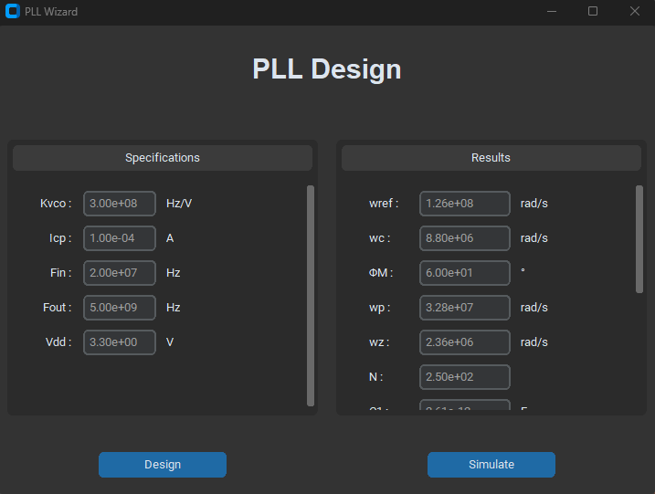
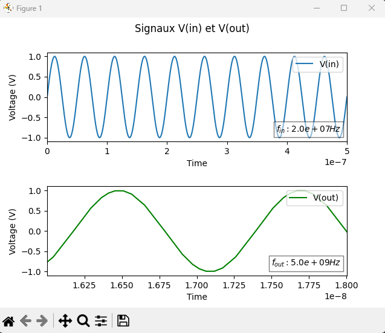
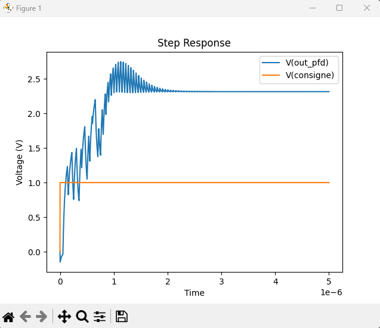
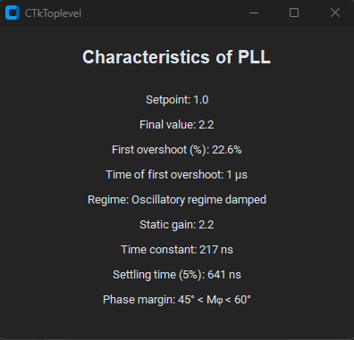

# Wizard de dimensionnement de PLL

Ce projet consiste en un outil de dimensionnement d'une boucle à verrouillage de phase (PLL, Phase Locked Loop) développé en Python. Il permet de dimensionner une PLL avec une architecture comprenant un détecteur de phase (PFD), une pompe de charge, un filtre de correction de phase, un oscillateur contrôlé en tension (VCO) et un diviseur de fréquence. Pour vérifier le bon dimensionnement, une simulation avec LTSpice est réalisée.

Une première fenêtre permet de définir les contraintes du cahier des charges. Si aucune valeur n'est saisie, des valeurs par défaut seront utilisées. Le bouton de simulation lance la siulation, qui peut prendre un certain temps (maximum 30 secondes). Si la fenêtre windows ne répond pas, attendre.

La fenêtre de résultat permet d'observer le bon dimensionnement de la PLL selon 3 points :

1. Observation des signaux d'entrée et de sortie de la PLL pour vérifier que la division/multiplication de fréquence a été effectuée correctement. Les mesures de fréquence en sortie et en entrée sont basées sur les signaux simulés, et non sur des valeurs théoriques.

2. Observation de la réponse de la PLL à un échelon, dans notre cas la tension en sortie du filtre qui attaque le VCO.

3. Caractéristiques de la PLL : 
  - Consigne
  - Valeur finale
  - Premier dépassement (%)
  - Moment du premier dépassement
  - Régime
  - Gain statique
  - Constante de temps
  - Temps d'établissement
  - Intervalle de la Marge de phase (selon l'abbaque Dépassement=f(Marge de Phase))

## Installation

1. Assurez-vous d'avoir installé Python sur votre système.
2. Clonez ce référentiel sur votre machine : `git clone https://github.com/votre_utilisateur/PLL_Wizard.git`
3. Accédez au répertoire du projet : `cd PLL_Wizard`
4. Installez les dépendances en utilisant `pip` : pip install -r requirements.txt

## Utilisation

1. Exécutez le script principal : `python main.py`
2. Suivez les instructions affichées à l'écran pour fournir les paramètres requis pour le dimensionnement de la PLL.
3. Le Wizard calculera les valeurs des différents composants de la PLL en fonction des paramètres fournis.
4. Les résultats du dimensionnement seront affichés à la fin de l'exécution.

## Structure du projet

Le projet est organisé de la manière suivante :

- `main.py` : Le script principal qui interagit avec l'utilisateur et effectue le dimensionnement de la PLL.
- `LTSpice_simulation.py` : Le module qui lance les simulations LTSpice à l'aide de la librairie PYLTSpice
- `PLL_design.py` : Le module contenant les fonctions et les calculs nécessaires pour le dimensionnement de la PLL.
- `PLL_Wizard_Python.asc` : Le fichier "schematic" permettant la simulation du circuit sur LTSpice.
- `Sim/` : Dossier contenant les résultats de simulation .NETLIST et .RAW
- `requirements.txt` : Le fichier contenant la liste des dépendances requises pour exécuter le projet.
- `README.md` : Ce fichier.

## Auteurs

- IMBERT Tristan
- BOUVET Victor

## Licence

Ce projet est sous licence [MIT](LICENSE). Vous êtes libre de l'utiliser à des fins personnelles ou commerciales. Consultez le fichier `LICENSE` pour plus d'informations.
